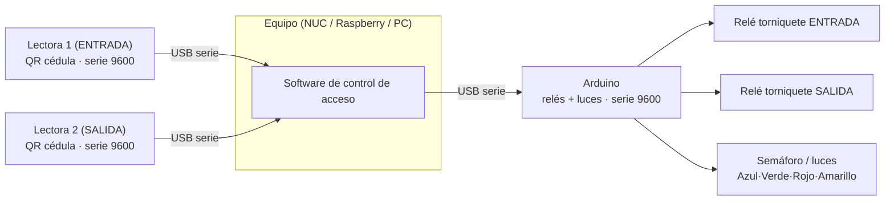
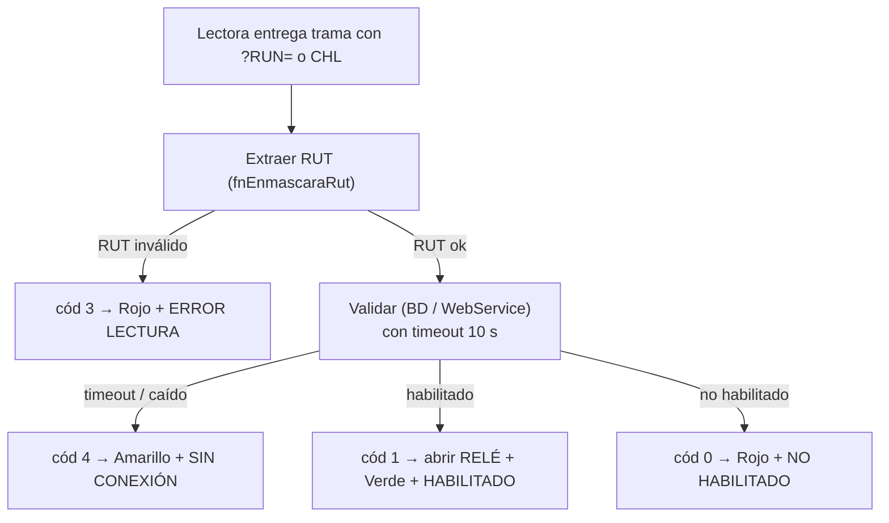

# Especificación de Hardware — Sistema de Control de Acceso (base sysCAP)

> Documento de referencia para reconstruir desde cero el **lado de hardware**.
> El equipo del proyecto nuevo se encarga de la parte **visual** y de **base de datos**;
> este documento describe TODO lo que el nuevo sistema debe replicar para hablar
> con los validadores (lectores) y con el Arduino (relés + luces).
>
> Fuente: `sysCAP - copia.py` v4.2 (Sopytec / Arauco). Referencias a líneas del original.

---

## 1. Topología del hardware



**Roles:**
- **Lectora 1** → sentido **`E`** (Entrada). Al habilitar dispara el relé de entrada.
- **Lectora 2** → sentido **`S`** (Salida). Al habilitar dispara el relé de salida.
- **Arduino** → único punto que controla **relés** (abrir torniquete) y **luces** (semáforo).
- Todo es **USB-serie a 9600 baud**. No hay red ni GPIO directo: el PC solo habla serie.

El sistema soporta **0, 1 o 2 lectoras** y **0 o 1 Arduino**. Si falta algo, sigue
funcionando en modo degradado (solo muestra estados en pantalla).

---

## 2. Inventario de dispositivos soportados

| Dispositivo | Cómo se identifica (texto en udev/descriptor USB) | Transporte |
|---|---|---|
| **Arduino** | contiene `arduino` | `/dev/ttyACM*` (típico Uno R3) o `/dev/ttyUSB*` |
| **Lectora Honeywell** | contiene `honeywell` | `/dev/ttyUSB*` o `ttyACM*` |
| **Lectora Symbol** (Zebra) | contiene `symbol` | `/dev/ttyUSB*` o `ttyACM*` |
| **Lectora Aigather** | contiene `aigather`, `1a86_usb_barcode_scanner`, `1a86_aigather_scan` | `/dev/ttyUSB*` (chip CH340) |
| **Cualquiera con chip CH340** | contiene `1a86` | `/dev/ttyUSB*` |

> ⚠️ **Gotcha crítico para relés:** la clasificación es por texto. Un **Arduino clon
> con chip CH340** (VID:PID `1a86:7523`, común en Nano/Uno chinos) se identifica como
> **lectora** (`1a86` → "Aigather"), **no como Arduino**. Si eso pasa, `usb_arduino`
> queda vacío y **los relés y luces nunca se accionan**. Ver §12.

Referencia: `_tipo_dispositivo()` — [`sysCAP - copia.py:494`](sysCAP - copia.py:494).

---

## 3. Detección y clasificación de puertos serie

### Linux
1. Enumerar puertos: `glob('/dev/ttyACM*')` + `glob('/dev/ttyUSB*')`.
2. Para cada uno, leer identidad con:
   ```bash
   udevadm info --name <ttyUSB0|ttyACM0>
   ```
3. Clasificar buscando (en minúsculas) las palabras clave de §2 dentro de la salida.

### Windows
1. Enumerar con `serial.tools.list_ports.comports()` → `(port, desc, hwid)`.
2. Clasificar con `desc + hwid + port`.

### Orden de asignación
- El **primer** puerto tipo Arduino → `usb_arduino`.
- El **primer** puerto tipo lectora libre → `Lectora 1`; el **segundo** → `Lectora 2`.
- Nunca se asigna el mismo puerto a dos roles (anti-duplicado).

Referencias: `AsignaPuertosSeriales()` [línea 625], `DynamicPortScanner._get_ports()` [línea 235].

---

## 4. Plug-and-play / hotplug (detección en caliente)

- Un escáner corre en background cada **10 s** (`scan_interval = 10.0`).
- Detecta puertos **añadidos** y **removidos** comparando contra el escaneo anterior.
- Al cambiar:
  - Arduino nuevo → reconecta (`ReconectarArduinoDinamico`).
  - Arduino removido → cierra y limpia (`DesconectarArduinoDinamico`).
  - Lectora removida → libera su slot (`usb_lectora1/2 = ''`).
  - Lectoras duplicadas → libera la segunda.
  - Lectora nueva → ocupa el primer slot libre.
- Los hilos de lectura detectan el cambio de puerto y **reabren solos**.

Referencias: `PortAssignmentManager` [línea 285], `DynamicPortScanner` [línea 191].

**Para el proyecto nuevo:** en Linux esto se puede hacer más robusto con `pyudev`
(eventos del kernel) en vez de polling cada 10 s, pero el polling funciona y es portable.

---

## 5. Parámetros serie

| Dispositivo | Baudios | `timeout` pyserial | Modo |
|---|---|---|---|
| **Arduino** | 9600 | `1` (1 s) | Lectura/escritura bloqueante corta |
| **Lectoras** | 9600 | `0` | **No bloqueante** (poll con `in_waiting`) |

- Data bits/paridad/stop: por defecto de pyserial (**8N1**).
- Tras abrir el Arduino se hace `time.sleep(1)` antes y después (el Uno se auto-resetea
  al abrir el puerto y necesita ~1–2 s para el bootloader). Referencia [línea 752].
- Las lectoras se leen por *polling*: `if in_waiting > 0: read(min(in_waiting, 1024))`.

Referencias: `AbreArduino()` [línea 740], `abrirLectoras()` [línea 1307], `SerialBufferManager` [línea 392].

---

## 6. Protocolo del Arduino (comandos que envía el PC)

Todos los comandos se envían en **ASCII**, terminados en **`*`**, con `.encode('ascii')`.
El firmware del Arduino debe **parsear tramas delimitadas por `*`**.

### 6.1 Relés (abrir torniquete)

| Comando | Constante | Se envía cuando… |
|---|---|---|
| `R2*` | `rele1` | Acceso **habilitado** por **Lectora 1 (Entrada, sentido `E`)** |
| `R1*` | `rele2` | Acceso **habilitado** por **Lectora 2 (Salida, sentido `S`)** |

> Nota: el mapeo está "cruzado" a propósito: `rele1='R2*'`, `rele2='R1*'`.
> Se envía **una sola vez** por acceso habilitado (pulso), justo **antes** de encender verde.
> Referencias: `abrirTorniquete()` [línea 901], constantes [líneas 151-152].

### 6.2 Luces (semáforo)

| Comando | Color / acción | Significado |
|---|---|---|
| `L1B*` | **Azul** | Leyendo / detección en curso |
| `L1G*` | **Verde** | Habilitado (acceso concedido) |
| `L1R*` | **Rojo** | No habilitado / error de lectura |
| `L1Y*` | **Amarillo** | Sin conexión a red (validador caído) |
| `LOFF*` | Apagar | Apaga luces (usado tras el amarillo, diferido ~3 s) |
| `TL3000*` | Parpadeo "listo" | Señal de "sistema listo", 1 vez al terminar la carga. El `3000` = duración/ms. |

Referencias: `spEnciendeLuzArduino()` [línea 913], `luzAzulLectura()` [línea 1167],
`EnviarBlinkSistemaListo()` [línea 815], `apagarLuzDespues()` [línea 888].

### 6.3 Requisitos que debe cumplir el firmware Arduino

El sketch (que ustedes conservan/rehacen) debe:
1. Escuchar serie a **9600 8N1**.
2. Acumular caracteres hasta recibir `*` y procesar el token.
3. Reconocer los tokens: `R1`, `R2`, `L1B`, `L1G`, `L1R`, `L1Y`, `LOFF`, `TL3000`.
4. `R1`/`R2` = pulso al relé correspondiente (activar N ms y soltar).
5. `L1x` = fijar color del semáforo; `LOFF` = apagar; `TL3000` = parpadeo temporizado.
6. **No** requiere responder nada al PC (el PC no lee respuestas del Arduino).

---

## 7. Máquina de estados: resultado de validación → luz + relé + pantalla

El corazón de la lógica de hardware. La función de validación devuelve un **código**
y con él se decide qué luz encender, si abrir el relé, y qué mostrar en pantalla.

| Código | Significado | Relé | Luz | Mensaje pantalla |
|:---:|---|:---:|:---:|---|
| **0** | NO habilitado | — | `L1R*` Rojo | "NO HABILITADO" |
| **1** | **HABILITADO** | **`R1*`/`R2*`** | `L1G*` Verde | "HABILITADO" |
| **2** | Rechazo especial (RUT nulo) | — | `L1R*` Rojo | "ERROR LECTURA / REINTENTE" |
| **3** | Lectura inválida (RUT `0`/vacío) | — | `L1R*` Rojo | "ERROR LECTURA / REINTENTE" |
| **4** | Sin conexión a red / timeout | — | `L1Y*` Amarillo (+`LOFF*` a los 3 s) | "SIN CONEXIÓN A RED" |



**Importante para pruebas de relé:** el relé **solo** dispara con **código 1**. Sin un
validador (BD/WS) que devuelva "habilitado", nunca verán abrir el relé con una lectura
real. Para banco de pruebas conviene un **modo test** que fuerce el código 1.

Referencia: `spEnciendeLuzArduino()` [línea 913], `ValidarAccesoConTimeout()` [línea 1190].

---

## 8. Protocolo de las lectoras (cédula chilena)

Las lectoras de QR/PDF417 emiten por serie el contenido del código de la **cédula de
identidad chilena**. El sistema **no** usa un protocolo propietario: lee texto crudo.

### 8.1 Disparo de procesamiento
Se acumulan bytes hasta que el buffer contiene **`?RUN=`** o **`CHL`**.

### 8.2 Extracción del RUT (`fnEnmascaraRut`, [línea 861])
- Si la trama tiene **`?RUN=`** (formato URL del PDF417 nuevo):
  `...?RUN=12345678-9&...` → toma lo que está entre `=` y `&`, quita el `-`.
- Si la trama contiene **`CHL`** (formato MRZ) y el primer carácter es dígito:
  toma los **primeros 9 caracteres**.
- Normaliza a **9 dígitos** rellenando con ceros a la izquierda (`rjust(9,'0')`).
- Si no reconoce el formato → devuelve `'0'` (se traduce a código 3, error lectura).

### 8.3 Flujo de lectura por lectora ([`abrirLectoras`, línea 1307])
1. Espera a tener puerto asignado; si no hay, reintenta cada 5 s.
2. Abre el puerto (9600, no bloqueante) y limpia buffers.
3. Loop: cada 100 ms lee lo disponible.
   - Al primer byte → enciende **azul** y muestra "VALIDANDO ACCESO".
   - Acumula en `data` hasta encontrar `?RUN=`/`CHL` → extrae RUT y valida.
   - **Overflow**: si `data > 256` chars sin trama válida → descarta (posible basura).
   - **Lectura incompleta**: si pasan **2 s** desde el último byte sin trama válida →
     descarta y muestra error (código 3).
4. **Watchdog por errores**: **5** descartes consecutivos → cierra y reabre el puerto.
5. **Watchdog de mantenimiento**: reabre el puerto cada **3600 s** (1 h).
6. Detecta cambio/removido de puerto y reabre/espera solo.

---

## 9. Fix de driver CH340 en Linux (`fix_ch340_driver`, [línea 531])

Algunos kernels/VMs no crean `/dev/ttyUSB*` para chips CH340 aunque el dispositivo
esté presente. Al arrancar, si **no** hay `ttyUSB*`/`ttyACM*` **y** `lsusb` muestra
`1a86:7523`, el sistema intenta (requiere **sudo**):

1. `sudo modprobe ch341`
2. Si no aparece el puerto, registrar driver genérico:
   ```bash
   echo 1a86 7523 | sudo tee /sys/bus/usb-serial/drivers/generic/new_id
   ```
3. Crear regla udev persistente en `/etc/udev/rules.d/99-ch340-generic.rules`:
   ```
   ACTION=="add", ATTRS{idVendor}=="1a86", ATTRS{idProduct}=="7523", RUN+="/bin/sh -c 'echo 1a86 7523 > /sys/bus/usb-serial/drivers/generic/new_id'"
   ```
4. `sudo udevadm control --reload-rules`

> En kernels modernos `ch341` se autocarga y `/dev/ttyUSB0` aparece solo → este fix
> retorna de inmediato sin usar sudo. Solo actúa si el puerto **no** apareció.
> Para el proyecto nuevo: mejor dejar esto como **script de instalación aparte**
> (con la regla udev), no dentro de la app, para no depender de sudo en runtime.

---

## 10. Salud, watchdogs y reconexión

| Mecanismo | Intervalo | Qué hace |
|---|---|---|
| **HealthMonitor** | 60 s | Verifica que el Arduino asignado esté abierto (si no, reconecta) y chequea conectividad del validador |
| **Watchdog lectora (errores)** | inmediato | 5 descartes seguidos → reabre el puerto |
| **Watchdog lectora (mantenimiento)** | 3600 s | Reabre el puerto preventivamente |
| **Scanner de puertos** | 10 s | Hotplug: detecta conexión/desconexión |
| **Reintento sin puerto** | 5 s | Si una lectora no tiene puerto, reintenta |

Referencias: `HealthMonitor` [línea 438], `abrirLectoras` [línea 1307].

---

## 11. Secuencia de arranque (orden que importa)

1. `fix_ch340_driver()` — asegurar que existan los `/dev/ttyUSB*`.
2. `AsignaPuertosSeriales()` — detección inicial y asignación de roles.
3. `AbreArduino()` — abrir el Arduino.
4. Lanzar 2 hilos de lectura (`abrirLectoras(1,'E')`, `abrirLectoras(2,'S')`).
5. `EnviarBlinkSistemaListo()` — enviar `TL3000*` (señal visible de "listo").
6. En paralelo arrancan: scanner de puertos (hotplug) y HealthMonitor.

Referencia: `InicializadorComponentes()` [línea 1638].

---

## 12. Reinicio programado del equipo (¡ojo en pruebas!)

- `rebota()` [línea 1690]: si la hora del sistema llega a **`horRB = "01:30"`**,
  ejecuta `shutdown -r now` → **reinicia el PC**. Controlado por `kill1 = 1`.
- `countdown()` [línea 1665]: reinicio de la **aplicación** (`os.execv`) tras
  `horaReinicio`/`minutos`/`segundos`. Controlado por `reiniciaAplicacion`.
- Antes de reiniciar siempre llama a `CerrarRecursos()` (libera seriales/sockets).

> Para pruebas dejar **`kill1 = 0`** y **`reiniciaAplicacion = 0`**.

---

## 13. Cierre ordenado de recursos (`CerrarRecursos`, [línea 1261])

Registrado con `atexit` y en `WM_DELETE_WINDOW`. Cierra en orden:
detiene scanner y health monitor → cierra todos los puertos de lectoras →
cierra el Arduino → cierra la sesión HTTP. **Imprescindible** para que al reiniciar
la app no encuentre los puertos ocupados.

---

## 14. Bloque de configuración de hardware (listo para reutilizar)

```python
# ===== IDENTIDAD DEL EQUIPO =====
Centro = 'CE05'
Reloj  = 'T010'

# ===== CAPACIDADES DEL HARDWARE =====
poseeRele     = 1     # 1 = hay Arduino con relés
poseePantalla = 1     # 1 = hay monitor (parte visual del nuevo proyecto)
poseeLuces    = 1     # 1 = hay semáforo/luces vía Arduino
# sentidoRele = 0     # DECLARADO PERO NO USADO en el original -> se puede eliminar

# ===== SENTIDO DE CADA LECTORA =====
sentidoLectora1 = 'E'   # Entrada
sentidoLectora2 = 'S'   # Salida

# ===== COMANDOS DE RELÉ (ASCII, terminados en *) =====
rele1 = 'R2*'   # relé de ENTRADA  (se dispara con Lectora 1)
rele2 = 'R1*'   # relé de SALIDA   (se dispara con Lectora 2)

# ===== PARÁMETROS SERIE =====
BAUD_ARDUINO   = 9600
BAUD_LECTORA   = 9600
# Arduino: serial.Serial(puerto, 9600, timeout=1)
# Lectora: serial.Serial(puerto, 9600, timeout=0)   # no bloqueante

# ===== TIEMPOS Y WATCHDOGS =====
VALIDACION_TIMEOUT_SEGUNDOS          = 10     # timeout de la validación (BD/WS)
MENSAJE_SIN_CONEXION_SEGUNDOS        = 10     # cuánto mantener "SIN CONEXIÓN" visible
LECTURA_INCOMPLETA_TIMEOUT_SEGUNDOS  = 2.0    # descartar lectura a medias
LECTORA_WATCHDOG_REABRIR_SEGUNDOS    = 3600   # reabrir puerto por mantenimiento
LECTORA_MAX_ERRORES_CONSECUTIVOS     = 5      # reabrir puerto tras N errores
HEALTH_CHECK_INTERVALO_SEGUNDOS      = 60     # chequeo de salud
SCAN_PUERTOS_INTERVALO_SEGUNDOS      = 10     # hotplug

# ===== REINICIO PROGRAMADO (dejar en 0 para pruebas) =====
kill1              = 0        # 1 = reinicia el PC a la hora horRB
horRB             = "01:30"
reiniciaAplicacion = 0        # 1 = reinicia la app (os.execv) por countdown

# ===== VID:PID relevantes =====
# CH340 (lectoras Aigather y clones): 1a86:7523
```

---

## 15. Requisitos del sistema operativo (Linux)

- Usuario en el grupo **`dialout`** (acceso a `/dev/ttyUSB*` y `/dev/ttyACM*`):
  ```bash
  sudo usermod -aG dialout $USER   # requiere re-login
  ```
- `udevadm` disponible (viene con systemd/udev).
- Para el fix CH340 automático: **sudo sin password** o, mejor, instalar la **regla udev**
  una sola vez (ver §9) y olvidarse de sudo en runtime.
- Python: el bundle offline actual cubre **3.6–3.13**. Para Python **3.14** hay que usar
  venv con wheels de PyPI o agregar los wheels `cp314` al bundle.

---

## 16. Resumen de "gotchas" para el proyecto nuevo

1. **Arduino CH340** → se confunde con lectora. Clasificar por **VID:PID** (o número de
   serie) en vez de solo por texto, o marcar el Arduino con un identificador propio.
2. **El relé solo abre con código 1** → sin validador que apruebe, no hay pulso. Hacer un
   **modo de prueba** que fuerce "habilitado" para probar relés en banco.
3. **`time.sleep(1)` al abrir Arduino** → no lo quiten: el auto-reset del Uno lo necesita.
4. **Lectoras no bloqueantes** (`timeout=0`) + polling: no usar `readline()` bloqueante.
5. **Cierre de recursos antes de reiniciar** → si no, los puertos quedan ocupados.
6. **`sentidoRele` es config muerta** → no lo arrastren.
7. **Anti-duplicado de puertos** → nunca asignar el mismo `/dev/tty*` a dos roles.
8. **`fix_ch340_driver` con sudo en runtime** es frágil → moverlo a instalación (udev).

---

*Generado como base de referencia de hardware. La parte visual y de BD las define el
equipo del proyecto nuevo; los contratos con el hardware (comandos, baudios, códigos,
formato de cédula) deben mantenerse tal como se describen aquí para conservar
compatibilidad con los validadores y el firmware del Arduino existentes.*
